# Documento de Design — Plataforma Rede Inspire

## Visão Geral

A Plataforma Rede Inspire é uma aplicação web responsiva construída com arquitetura serverless na AWS. O frontend é uma Single Page Application (SPA) em React/TypeScript, servida via S3 + CloudFront. O backend utiliza AWS Lambda + API Gateway para APIs REST, DynamoDB para persistência, S3 para armazenamento de mídia e Cognito para autenticação. O sistema de busca utiliza OpenSearch para busca difusa e por sinônimos. Recomendações são geradas via Amazon Personalize.

## Arquitetura

```mermaid
graph TB
    subgraph "Frontend"
        SPA[React SPA - TypeScript]
        CF[CloudFront CDN]
        S3F[S3 - Hosting]
    end

    subgraph "Autenticação"
        COG[AWS Cognito]
        CONEXA[Conexa API - Externa]
    end

    subgraph "API Layer"
        APIGW[API Gateway REST]
        AUTH[Lambda Authorizer]
    end

    subgraph "Backend - Lambdas"
        L_AUTH[Lambda Auth]
        L_CONTENT[Lambda Conteúdos]
        L_SEARCH[Lambda Busca]
        L_REC[Lambda Recomendações]
        L_TRAIL[Lambda Trilhas]
        L_MENTOR[Lambda Mentorias]
        L_DASH[Lambda Dashboard]
        L_MSG[Lambda Mensagens]
        L_PLAN[Lambda Planejamento]
        L_MAP[Lambda Mapa]
        L_REPORT[Lambda Relatórios]
        L_PODCAST[Lambda Podcast]
        L_SYNC[Lambda Sincronização]
    end

    subgraph "Dados"
        DDB[DynamoDB]
        S3M[S3 - Mídia]
        OS[OpenSearch]
        PERS[Amazon Personalize]
    end

    subgraph "Integrações"
        ZOOM[Zoom API]
        WA[WhatsApp Link]
    end

    SPA --> CF --> S3F
    SPA --> APIGW
    APIGW --> AUTH --> COG
    APIGW --> L_AUTH
    APIGW --> L_CONTENT
    APIGW --> L_SEARCH
    APIGW --> L_REC
    APIGW --> L_TRAIL
    APIGW --> L_MENTOR
    APIGW --> L_DASH
    APIGW --> L_MSG
    APIGW --> L_PLAN
    APIGW --> L_MAP
    APIGW --> L_REPORT
    APIGW --> L_PODCAST
    APIGW --> L_SYNC

    L_CONTENT --> DDB
    L_CONTENT --> S3M
    L_SEARCH --> OS
    L_REC --> PERS
    L_TRAIL --> DDB
    L_MENTOR --> DDB
    L_DASH --> DDB
    L_MSG --> DDB
    L_PLAN --> DDB
    L_MAP --> DDB
    L_REPORT --> DDB
    L_PODCAST --> S3M
    L_SYNC --> CONEXA

    L_MENTOR --> ZOOM
```



### Decisões Arquiteturais

1. **SPA com React/TypeScript**: Escolhido pela maturidade do ecossistema, tipagem estática e ampla comunidade. Permite experiência fluida sem recarregamento de página.
2. **Serverless (Lambda)**: Elimina gerenciamento de servidores, escala automaticamente e reduz custos para uso variável.
3. **DynamoDB**: Banco NoSQL com latência baixa e escalabilidade automática, ideal para padrões de acesso por chave primária.
4. **OpenSearch**: Necessário para busca difusa, sinônimos e busca full-text que DynamoDB não suporta nativamente.
5. **Amazon Personalize**: Serviço gerenciado de ML para recomendações, evitando construir modelo próprio.
6. **Cognito**: Autenticação gerenciada com suporte a grupos de usuários e integração nativa com API Gateway.

## Componentes e Interfaces

### 1. Módulo de Autenticação (`auth`)

```typescript
interface AuthService {
  registerLeader(pastorId: string, leaderData: CreateLeaderDTO): Promise<Leader>;
  login(credentials: LoginDTO): Promise<AuthSession>;
  deactivateLeader(pastorId: string, leaderId: string): Promise<void>;
  syncConexaStatus(churchId: string, status: 'blocked' | 'unblocked'): Promise<void>;
  getUserProfile(userId: string): Promise<UserProfile>;
}

interface CreateLeaderDTO {
  name: string;
  email: string;
  cpf: string;
  ministries: string[];
  churchId: string;
}

interface LoginDTO {
  email: string;
  password: string;
}

interface AuthSession {
  accessToken: string;
  refreshToken: string;
  userProfile: UserProfile;
}

interface UserProfile {
  userId: string;
  name: string;
  email: string;
  role: 'pastor_presidente' | 'lider' | 'membro';
  churchId: string;
  ministries: string[];
  status: 'active' | 'inactive' | 'blocked';
}
```

### 2. Módulo de Conteúdos (`content`)

```typescript
interface ContentService {
  listByCategory(categorySlug: string, pagination: PaginationDTO): Promise<PaginatedResult<Content>>;
  getContent(contentId: string): Promise<ContentDetail>;
  getCategories(): Promise<Category[]>;
  applyFilters(filters: ContentFilterDTO): Promise<PaginatedResult<Content>>;
  getTrending(limit: number): Promise<Content[]>;
  getNewReleases(limit: number): Promise<Content[]>;
  getTop10(): Promise<Content[]>;
}

interface Content {
  contentId: string;
  title: string;
  description: string;
  categorySlug: string;
  type: 'video' | 'audio' | 'document' | 'link';
  durationMinutes: number;
  thumbnailUrl: string;
  createdAt: string;
  popularity: number;
}

interface Category {
  slug: string;
  name: string;
  description: string;
  subcategories?: Category[];
  contentCount: number;
}

interface ContentFilterDTO {
  categorySlug?: string;
  type?: string;
  dateFrom?: string;
  dateTo?: string;
  sortBy: 'relevance' | 'date' | 'popularity';
  page: number;
  pageSize: number;
}
```

### 3. Módulo de Busca (`search`)

```typescript
interface SearchService {
  search(query: string, filters?: SearchFilterDTO): Promise<SearchResult>;
  autocomplete(partialQuery: string): Promise<string[]>;
  getSuggestions(query: string): Promise<string[]>;
}

interface SearchResult {
  items: Content[];
  totalCount: number;
  suggestions: string[];
  facets: Record<string, FacetCount[]>;
}

interface SearchFilterDTO {
  category?: string;
  type?: string;
  sortBy: 'relevance' | 'date' | 'popularity' | 'category';
  page: number;
  pageSize: number;
}
```

### 4. Módulo de Recomendações (`recommendations`)

```typescript
interface RecommendationService {
  getRecommendations(userId: string, limit: number): Promise<Content[]>;
  recordInteraction(userId: string, contentId: string, eventType: 'view' | 'complete' | 'download'): Promise<void>;
  refreshRecommendations(userId: string): Promise<void>;
}
```

### 5. Módulo de Trilhas e Academy (`trails`)

```typescript
interface TrailService {
  getTrails(userId: string): Promise<Trail[]>;
  getTrailDetail(trailId: string, userId: string): Promise<TrailDetail>;
  startTrail(userId: string, trailId: string): Promise<TrailProgress>;
  completeModule(userId: string, trailId: string, moduleId: string): Promise<TrailProgress>;
  getCertificate(userId: string, trailId: string): Promise<Certificate>;
  getAcademyCourses(): Promise<AcademyCourse[]>;
}

interface Trail {
  trailId: string;
  title: string;
  description: string;
  modules: TrailModule[];
  totalDurationMinutes: number;
  points: number;
  isMandatory: boolean;
}

interface TrailProgress {
  trailId: string;
  userId: string;
  completedModules: string[];
  percentComplete: number;
  startedAt: string;
  completedAt?: string;
}

interface Certificate {
  certificateId: string;
  trailId: string;
  userId: string;
  issuedAt: string;
  downloadUrl: string;
}
```

### 6. Módulo de Mentorias e Webinars (`mentoring`)

```typescript
interface MentoringService {
  getUpcomingWebinars(): Promise<Webinar[]>;
  getMentoringSessions(userId: string): Promise<MentoringSession[]>;
  registerParticipation(userId: string, sessionId: string): Promise<void>;
  completeSession(sessionId: string, userId: string): Promise<void>;
}

interface Webinar {
  webinarId: string;
  title: string;
  description: string;
  scheduledAt: string;
  meetingUrl: string;
  hostName: string;
}

interface MentoringSession {
  sessionId: string;
  title: string;
  mentorName: string;
  status: 'scheduled' | 'in_progress' | 'completed';
  scheduledAt: string;
  meetingUrl?: string;
}
```

### 7. Módulo de Dashboard Pastoral (`dashboard`)

```typescript
interface DashboardService {
  getChurchMetrics(churchId: string): Promise<ChurchMetrics>;
  getLeaderReport(churchId: string, leaderId: string): Promise<LeaderReport>;
  getLeaderRanking(churchId: string): Promise<LeaderRanking[]>;
  getChurchTimeline(churchId: string): Promise<TimelineEvent[]>;
  exportReport(churchId: string, format: 'excel' | 'pdf', filters?: ReportFilterDTO): Promise<string>;
}

interface ChurchMetrics {
  totalLeaders: number;
  activeLeaders: number;
  totalContentAccessed: number;
  trailsInProgress: number;
  trailsCompleted: number;
  topContent: Content[];
  recentAccesses: LeaderAccess[];
}

interface LeaderReport {
  leader: UserProfile;
  completedResources: Content[];
  inProgressResources: Content[];
  recentDownloads: Content[];
  trailProgress: TrailProgress[];
  lastAccessAt: string;
}

interface LeaderRanking {
  leader: UserProfile;
  engagementScore: number;
  rank: number;
}
```

### 8. Módulo de Mensagens (`messaging`)

```typescript
interface MessagingService {
  sendMessage(fromUserId: string, toUserId: string, message: CreateMessageDTO): Promise<Message>;
  getInbox(userId: string, pagination: PaginationDTO): Promise<PaginatedResult<Message>>;
  markAsRead(userId: string, messageId: string): Promise<void>;
  getUnreadCount(userId: string): Promise<number>;
}

interface Message {
  messageId: string;
  fromUserId: string;
  fromName: string;
  toUserId: string;
  subject: string;
  body: string;
  isRead: boolean;
  createdAt: string;
}
```

### 9. Módulo de Mapa (`map`)

```typescript
interface MapService {
  getChurches(): Promise<ChurchPin[]>;
  getChurchDetail(churchId: string): Promise<ChurchDetail>;
  getTopChurchesByEngagement(month: string, limit: number): Promise<ChurchRanking[]>;
}

interface ChurchPin {
  churchId: string;
  name: string;
  city: string;
  state: string;
  latitude: number;
  longitude: number;
}

interface ChurchDetail {
  churchId: string;
  name: string;
  city: string;
  state: string;
  pastorName: string;
  cnpj: string;
  memberCount: number;
}
```

### 10. Módulo de Planejamento (`planning`)

```typescript
interface PlanningService {
  createSundayPlan(userId: string, plan: SundayPlanDTO): Promise<Plan>;
  createAnnualPlan(userId: string, plan: AnnualPlanDTO): Promise<Plan>;
  createMinistryPlan(userId: string, plan: MinistryPlanDTO): Promise<Plan>;
  getPlan(planId: string): Promise<Plan>;
  updatePlan(planId: string, updates: Partial<Plan>): Promise<Plan>;
  getUserPlans(userId: string): Promise<Plan[]>;
}

interface Plan {
  planId: string;
  userId: string;
  type: 'sunday' | 'annual' | 'ministry';
  title: string;
  data: Record<string, unknown>;
  createdAt: string;
  updatedAt: string;
}
```

### 11. Módulo de Podcast (`podcast`)

```typescript
interface PodcastService {
  getEpisodes(pagination: PaginationDTO): Promise<PaginatedResult<PodcastEpisode>>;
  getEpisode(episodeId: string): Promise<PodcastEpisode>;
  getPlaybackProgress(userId: string, episodeId: string): Promise<number>;
  savePlaybackProgress(userId: string, episodeId: string, positionSeconds: number): Promise<void>;
}

interface PodcastEpisode {
  episodeId: string;
  title: string;
  description: string;
  durationSeconds: number;
  audioUrl: string;
  publishedAt: string;
}
```

## Modelos de Dados

### Tabelas DynamoDB

#### Tabela: `Users`
| Atributo | Tipo | Descrição |
|----------|------|-----------|
| PK | String | `USER#<userId>` |
| SK | String | `PROFILE` |
| GSI1PK | String | `CHURCH#<churchId>` |
| GSI1SK | String | `USER#<userId>` |
| name | String | Nome completo |
| email | String | Email (único) |
| cpf | String | CPF do líder |
| role | String | `pastor_presidente`, `lider`, `membro` |
| churchId | String | ID da igreja filiada |
| ministries | List<String> | Ministérios de atuação |
| status | String | `active`, `inactive`, `blocked` |
| createdAt | String | ISO 8601 |
| lastAccessAt | String | ISO 8601 |

#### Tabela: `Content`
| Atributo | Tipo | Descrição |
|----------|------|-----------|
| PK | String | `CONTENT#<contentId>` |
| SK | String | `META` |
| GSI1PK | String | `CATEGORY#<categorySlug>` |
| GSI1SK | String | `<createdAt>` |
| title | String | Título do conteúdo |
| description | String | Descrição |
| categorySlug | String | Slug da categoria |
| type | String | `video`, `audio`, `document`, `link` |
| durationMinutes | Number | Duração estimada |
| mediaUrl | String | URL no S3 |
| thumbnailUrl | String | URL da thumbnail |
| popularity | Number | Score de popularidade |
| tags | List<String> | Tags para busca |

#### Tabela: `Trails`
| Atributo | Tipo | Descrição |
|----------|------|-----------|
| PK | String | `TRAIL#<trailId>` |
| SK | String | `META` |
| title | String | Título da trilha |
| description | String | Descrição |
| modules | List<Map> | Lista de módulos |
| totalDurationMinutes | Number | Duração total |
| points | Number | Pontos ao concluir |
| isMandatory | Boolean | Se é obrigatória |

#### Tabela: `TrailProgress`
| Atributo | Tipo | Descrição |
|----------|------|-----------|
| PK | String | `USER#<userId>` |
| SK | String | `TRAIL#<trailId>` |
| completedModules | List<String> | IDs dos módulos concluídos |
| percentComplete | Number | 0-100 |
| startedAt | String | ISO 8601 |
| completedAt | String | ISO 8601 (nullable) |

#### Tabela: `Messages`
| Atributo | Tipo | Descrição |
|----------|------|-----------|
| PK | String | `INBOX#<toUserId>` |
| SK | String | `MSG#<createdAt>#<messageId>` |
| GSI1PK | String | `SENT#<fromUserId>` |
| fromUserId | String | ID do remetente |
| fromName | String | Nome do remetente |
| subject | String | Assunto |
| body | String | Corpo da mensagem |
| isRead | Boolean | Se foi lida |
| createdAt | String | ISO 8601 |

#### Tabela: `Churches`
| Atributo | Tipo | Descrição |
|----------|------|-----------|
| PK | String | `CHURCH#<churchId>` |
| SK | String | `META` |
| name | String | Nome da igreja |
| cnpj | String | CNPJ |
| city | String | Cidade |
| state | String | Estado (UF) |
| latitude | Number | Latitude |
| longitude | Number | Longitude |
| pastorId | String | ID do pastor presidente |
| status | String | `active`, `blocked` |
| conexaId | String | ID no sistema Conexa |

#### Tabela: `Plans`
| Atributo | Tipo | Descrição |
|----------|------|-----------|
| PK | String | `USER#<userId>` |
| SK | String | `PLAN#<planId>` |
| type | String | `sunday`, `annual`, `ministry` |
| title | String | Título do plano |
| data | Map | Dados do planejamento |
| createdAt | String | ISO 8601 |
| updatedAt | String | ISO 8601 |

#### Tabela: `Interactions` (para Personalize)
| Atributo | Tipo | Descrição |
|----------|------|-----------|
| PK | String | `USER#<userId>` |
| SK | String | `INT#<timestamp>` |
| contentId | String | ID do conteúdo |
| eventType | String | `view`, `complete`, `download` |
| timestamp | String | ISO 8601 |

### Índice OpenSearch: `content-index`

```json
{
  "mappings": {
    "properties": {
      "contentId": { "type": "keyword" },
      "title": { "type": "text", "analyzer": "portuguese_synonyms" },
      "description": { "type": "text", "analyzer": "portuguese_synonyms" },
      "categorySlug": { "type": "keyword" },
      "type": { "type": "keyword" },
      "tags": { "type": "text", "analyzer": "portuguese_synonyms" },
      "popularity": { "type": "float" },
      "createdAt": { "type": "date" }
    }
  }
}
```


## Propriedades de Corretude

*Uma propriedade é uma característica ou comportamento que deve ser verdadeiro em todas as execuções válidas de um sistema — essencialmente, uma declaração formal sobre o que o sistema deve fazer. Propriedades servem como ponte entre especificações legíveis por humanos e garantias de corretude verificáveis por máquina.*

### Property 1: Registro de líder com associação à igreja
*Para qualquer* dados válidos de líder e igreja filiada, registrar o líder e depois consultá-lo deve retornar o mesmo líder com a igreja correta associada.
**Validates: Requirements 1.1**

### Property 2: Login com credenciais válidas retorna sessão
*Para qualquer* usuário registrado com credenciais válidas, o login deve retornar uma sessão com token de acesso e perfil do usuário correto.
**Validates: Requirements 1.2**

### Property 3: Credenciais inválidas são rejeitadas
*Para qualquer* combinação de credenciais que não corresponda a um usuário registrado, o login deve falhar e registrar a tentativa.
**Validates: Requirements 1.3**

### Property 4: Desativação revoga acesso
*Para qualquer* líder ativo, após desativação pelo pastor presidente, o líder não deve conseguir autenticar.
**Validates: Requirements 1.4**

### Property 5: Controle de acesso por perfil
*Para qualquer* usuário com um dado perfil (pastor_presidente, lider, membro), o sistema deve permitir acesso apenas às funcionalidades autorizadas para aquele perfil.
**Validates: Requirements 1.5**

### Property 6: Bloqueio Conexa propaga para todos os usuários da igreja
*Para qualquer* igreja filiada com N usuários, quando a Conexa sinaliza bloqueio, todos os N usuários daquela igreja devem ter status "blocked".
**Validates: Requirements 1.6**

### Property 7: Sugestões correspondem ao ministério do usuário
*Para qualquer* usuário com ministérios atribuídos, as sugestões de conteúdo na página inicial devem pertencer a categorias relacionadas aos ministérios do usuário.
**Validates: Requirements 2.2**

### Property 8: Progresso exibido para trilhas em andamento
*Para qualquer* usuário com trilhas em andamento, os dados da página inicial devem incluir informações de progresso para cada trilha ativa.
**Validates: Requirements 2.3**

### Property 9: Próximo webinar é o mais próximo no futuro
*Para qualquer* conjunto de webinars agendados, o webinar exibido como "próximo" deve ser aquele com a data mais próxima no futuro.
**Validates: Requirements 2.4**

### Property 10: Trending ordenado por engajamento recente
*Para qualquer* conjunto de conteúdos com dados de engajamento, a lista de trending deve estar ordenada por score de engajamento recente em ordem decrescente.
**Validates: Requirements 2.6**

### Property 11: Conteúdo pertence a categoria válida
*Para qualquer* conteúdo no sistema, sua categoria deve ser uma das categorias definidas na especificação.
**Validates: Requirements 3.1**

### Property 12: Listagem por categoria é completa
*Para qualquer* categoria, a listagem deve retornar todos os conteúdos associados àquela categoria e nenhum conteúdo de outra categoria.
**Validates: Requirements 3.2**

### Property 13: Conteúdo possui campos obrigatórios
*Para qualquer* conteúdo no sistema, os campos descrição, duração estimada e tipo de mídia devem estar preenchidos.
**Validates: Requirements 3.3**

### Property 14: Filtros retornam apenas conteúdos correspondentes
*Para qualquer* combinação de filtros (tipo, categoria, data, popularidade), todos os conteúdos retornados devem satisfazer todos os critérios de filtro aplicados.
**Validates: Requirements 3.4**

### Property 15: Busca por palavra-chave retorna conteúdo relevante
*Para qualquer* termo de busca que existe no título ou descrição de um conteúdo, a busca deve incluir esse conteúdo nos resultados.
**Validates: Requirements 4.1**

### Property 16: Resultados de busca respeitam ordenação
*Para qualquer* lista de resultados de busca com parâmetro de ordenação (data, popularidade, categoria), os resultados devem estar ordenados conforme o critério selecionado.
**Validates: Requirements 4.3**

### Property 17: Autocompletar ativa após terceiro caractere
*Para qualquer* input de busca com 3 ou mais caracteres, o autocompletar deve retornar sugestões. Para inputs com menos de 3 caracteres, nenhuma sugestão deve ser retornada.
**Validates: Requirements 4.4**

### Property 18: Interação registrada atualiza recomendações
*Para qualquer* usuário, ao concluir um conteúdo, a interação deve ser registrada e as recomendações devem ser atualizadas (o timestamp de atualização deve mudar).
**Validates: Requirements 5.2**

### Property 19: Progresso de trilha é proporcional aos módulos concluídos
*Para qualquer* trilha com N módulos, ao concluir K módulos, o percentual de progresso deve ser igual a (K/N) * 100.
**Validates: Requirements 6.1**

### Property 20: Conclusão de trilha gera certificado
*Para qualquer* trilha, ao concluir todos os módulos, um certificado deve ser gerado e pontos de progresso devem ser registrados na Inspire Academy.
**Validates: Requirements 6.2**

### Property 21: Dashboard reflete progresso real dos líderes
*Para qualquer* igreja com líderes em diferentes estágios de trilhas, o dashboard pastoral deve refletir corretamente o status de cada líder (concluído vs. em andamento).
**Validates: Requirements 6.3**

### Property 22: Novo líder recebe trilha Boas Vindas
*Para qualquer* líder recém-criado, a trilha "Boas Vindas" deve ser automaticamente atribuída como obrigatória.
**Validates: Requirements 6.4**

### Property 23: Cursos da Academy possuem campos obrigatórios
*Para qualquer* curso na Inspire Academy, os campos descrição, carga horária e pontos de progresso devem estar preenchidos.
**Validates: Requirements 6.5**

### Property 24: Webinar agendado possui URL de acesso
*Para qualquer* webinar com status "scheduled", o campo meetingUrl deve estar preenchido com uma URL válida.
**Validates: Requirements 7.1**

### Property 25: Participação em mentoria é registrada (round-trip)
*Para qualquer* sessão de mentoria e participante, registrar participação e depois consultar deve retornar o registro de participação.
**Validates: Requirements 7.2**

### Property 26: Conclusão de mentoria notifica pastor
*Para qualquer* mentoria concluída, o perfil do líder deve refletir a conclusão e uma notificação deve existir para o pastor presidente.
**Validates: Requirements 7.3**

### Property 27: Métricas do dashboard correspondem aos dados reais
*Para qualquer* igreja com dados de atividade, as métricas do dashboard (total de acessos, trilhas em andamento, conteúdos mais acessados) devem corresponder aos dados subjacentes.
**Validates: Requirements 8.1**

### Property 28: Exportação de relatório gera arquivo válido
*Para qualquer* solicitação de exportação com formato 'excel' ou 'pdf', o sistema deve retornar uma URL de download para um arquivo válido.
**Validates: Requirements 8.2**

### Property 29: Ranking de líderes ordenado por engajamento
*Para qualquer* conjunto de líderes com scores de engajamento, o ranking deve estar ordenado em ordem decrescente de score.
**Validates: Requirements 8.3**

### Property 30: Relatório do líder categoriza recursos corretamente
*Para qualquer* líder com atividade, o relatório deve separar corretamente recursos em concluídos, em andamento e downloads recentes, sem sobreposição incorreta.
**Validates: Requirements 8.5**

### Property 31: Mensagem entregue e contagem de não-lidas atualizada
*Para qualquer* mensagem enviada de pastor para líder, a mensagem deve aparecer na caixa de entrada do líder e a contagem de mensagens não lidas deve aumentar em 1.
**Validates: Requirements 9.1, 9.2**

### Property 32: Mapa contém todas as igrejas
*Para qualquer* conjunto de igrejas filiadas ativas, o endpoint do mapa deve retornar pins para todas elas.
**Validates: Requirements 10.1**

### Property 33: Detalhe da igreja possui campos obrigatórios
*Para qualquer* igreja filiada, o detalhe deve conter nome, cidade e nome do pastor responsável.
**Validates: Requirements 10.2**

### Property 34: Top igrejas ordenadas por engajamento
*Para qualquer* conjunto de igrejas com dados de engajamento mensal, o ranking deve estar ordenado em ordem decrescente.
**Validates: Requirements 10.3**

### Property 35: Planejamento round-trip
*Para qualquer* dados de planejamento (domingo, anual ou ministério), salvar e depois recuperar deve retornar dados equivalentes ao original.
**Validates: Requirements 11.3**

### Property 36: Episódios de podcast possuem campos obrigatórios
*Para qualquer* episódio de podcast, os campos título, descrição e duração devem estar preenchidos.
**Validates: Requirements 13.1**

### Property 37: Progresso de podcast round-trip
*Para qualquer* episódio e posição de reprodução, salvar o progresso e depois recuperar deve retornar a mesma posição.
**Validates: Requirements 13.3**

### Property 38: Atualização de status Conexa é aplicada corretamente
*Para qualquer* sinal de bloqueio ou desbloqueio da Conexa, o status da igreja filiada deve ser atualizado para o valor correspondente.
**Validates: Requirements 14.1**

### Property 39: Sincronização de cadastro preserva dados
*Para qualquer* dados de cadastro (CNPJ e CPF), a sincronização deve preservar os dados sem alteração.
**Validates: Requirements 14.2**

### Property 40: Falha de integração preserva estado anterior
*Para qualquer* falha de integração com sistema externo, o sistema deve manter o último estado válido conhecido e registrar o erro em log.
**Validates: Requirements 14.3**

## Tratamento de Erros

### Erros de Autenticação
- Credenciais inválidas: retornar HTTP 401 com mensagem genérica (sem revelar se email ou senha está incorreto)
- Token expirado: retornar HTTP 401 com código `TOKEN_EXPIRED`, frontend deve tentar refresh automático
- Usuário bloqueado: retornar HTTP 403 com mensagem indicando contato com administrador
- Permissão insuficiente: retornar HTTP 403 com código `INSUFFICIENT_PERMISSIONS`

### Erros de Dados
- Conteúdo não encontrado: retornar HTTP 404 com mensagem descritiva
- Dados de entrada inválidos: retornar HTTP 400 com detalhes de validação por campo
- Conflito de dados (ex: email duplicado): retornar HTTP 409 com identificação do conflito

### Erros de Integração
- Falha na comunicação com Conexa: registrar em CloudWatch, manter último estado válido, retry com backoff exponencial (máximo 3 tentativas)
- Falha no OpenSearch: fallback para busca simples no DynamoDB com funcionalidade reduzida
- Falha no Amazon Personalize: retornar conteúdos populares como fallback de recomendação
- Timeout em Lambda: configurar timeout adequado por função (busca: 10s, relatórios: 30s, exportação: 60s)

### Erros de Exportação
- Falha na geração de relatório: retornar HTTP 500 com ID de correlação para suporte
- Arquivo muito grande: limitar período do relatório e informar o usuário

### Padrão de Resposta de Erro

```typescript
interface ErrorResponse {
  statusCode: number;
  errorCode: string;
  message: string;
  details?: Record<string, string>;
  correlationId: string;
  timestamp: string;
}
```

## Estratégia de Testes

### Abordagem Dual: Testes Unitários + Testes Baseados em Propriedades

A estratégia de testes combina testes unitários para exemplos específicos e casos de borda com testes baseados em propriedades para validação universal.

### Testes Unitários
- Foco em exemplos específicos, casos de borda e condições de erro
- Validação de integrações entre componentes
- Testes de endpoints da API com payloads específicos
- Framework: Jest (TypeScript)

### Testes Baseados em Propriedades (PBT)
- Biblioteca: **fast-check** (TypeScript)
- Mínimo de 100 iterações por teste de propriedade
- Cada teste deve referenciar a propriedade do documento de design
- Formato de tag: **Feature: plataforma-rede-inspire, Property {número}: {título}**
- Cada propriedade de corretude deve ser implementada por um ÚNICO teste baseado em propriedade

### Cobertura por Módulo

| Módulo | Testes Unitários | Testes de Propriedade |
|--------|-----------------|----------------------|
| Auth | Login, registro, desativação | Properties 1-6 |
| Content | CRUD, listagem, filtros | Properties 11-14 |
| Search | Busca, autocompletar | Properties 15-17 |
| Recommendations | Registro de interação | Property 18 |
| Trails | Progresso, certificados | Properties 19-23 |
| Mentoring | Participação, conclusão | Properties 24-26 |
| Dashboard | Métricas, exportação, ranking | Properties 27-30 |
| Messaging | Envio, inbox, notificações | Property 31 |
| Map | Listagem, detalhe, ranking | Properties 32-34 |
| Planning | CRUD de planos | Property 35 |
| Podcast | Listagem, progresso | Properties 36-37 |
| Integration | Conexa, sincronização | Properties 38-40 |

### Testes de Integração
- Testes end-to-end dos fluxos principais via API Gateway
- Testes de integração com DynamoDB usando DynamoDB Local
- Testes de integração com OpenSearch usando container Docker
- Mock de serviços externos (Conexa, Zoom)
