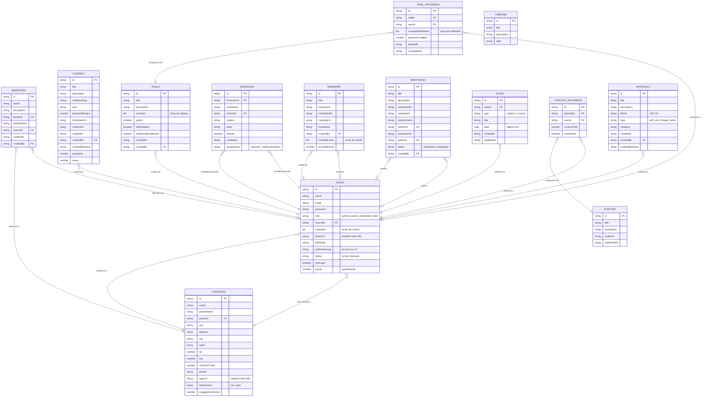
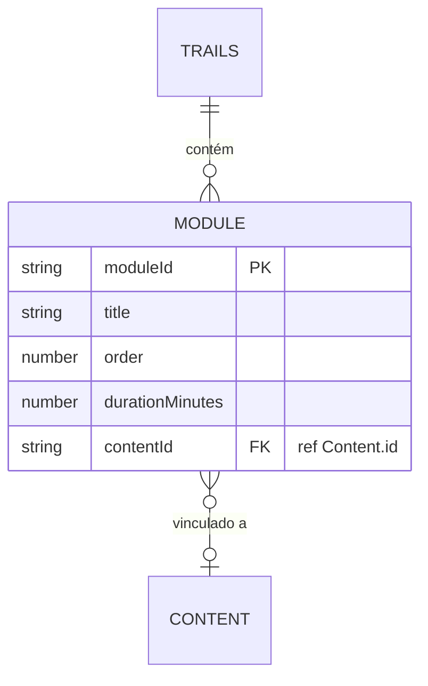
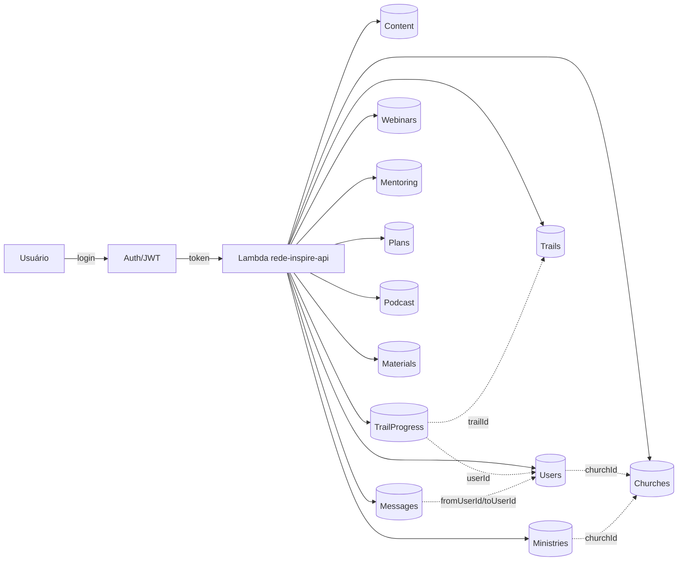

# 🗄️ Diagrama de Tabelas — Plataforma Rede Inspire

> DynamoDB — Região: us-east-1

---

## Diagrama Entidade-Relacionamento (Mermaid)

---

## Detalhamento dos Módulos (dentro de Trails)

---

## Resumo das Tabelas

| # | Tabela DynamoDB | PK | Registros Típicos |
|---|----------------|----|--------------------|
| 1 | `RedeInspire-Users` | `id` | Usuários (admin, pastores, líderes) |
| 2 | `RedeInspire-Churches` | `id` | Igrejas filiadas à rede |
| 3 | `RedeInspire-Ministries` | `id` | Ministérios das igrejas |
| 4 | `RedeInspire-Content` | `id` | Conteúdos (vídeos, PDFs, artigos) |
| 5 | `RedeInspire-Trails` | `id` | Trilhas de capacitação |
| 6 | `RedeInspire-TrailProgress` | `id` | Progresso de usuários nas trilhas |
| 7 | `RedeInspire-Messages` | `id` | Mensagens entre usuários |
| 8 | `RedeInspire-Webinars` | `id` | Webinars agendados |
| 9 | `RedeInspire-Mentoring` | `id` | Sessões de mentoria |
| 10 | `RedeInspire-Plans` | `id` | Planejamentos pessoais |
| 11 | `RedeInspire-Podcast` | `id` | Episódios de podcast |
| 12 | `RedeInspire-PodcastProgress` | `id` | Progresso de escuta |
| 13 | `RedeInspire-Timeline` | `id` | Eventos da timeline |
| 14 | `RedeInspire-Materials` | `id` | Materiais para download |

---

## Fluxo de Dados Principais

